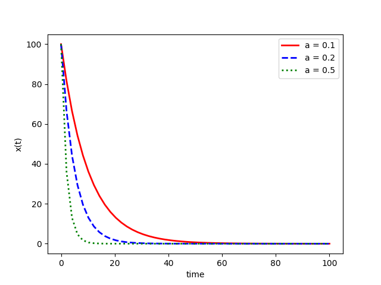
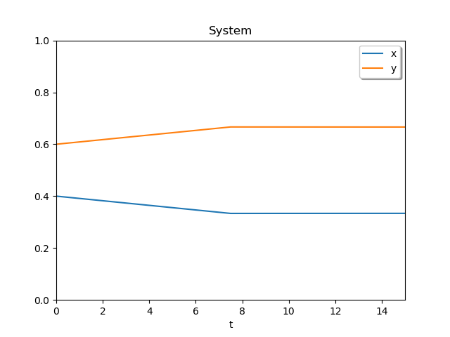

# rate_equation_test
 レート方程式の練習

## 目標
* 微分方程式のグラフをpythonを用いて作成したい。

## 方法
* EmEditorに微分方程式のプログラミングを記入する。
* プログラミングは https://qiita.com/maskot1977/items/b4395da5f33f70cd4a09 と大学の講義の内容をを参考に行った。
* scipy.integrate.odeintは連立常微分方程式を解くためのツールである。
* このツールを使わないで解く方法はないのか疑問に感じた。

## 結果

# 連立微分方程式

## 目標
* python を用いて連立微分方程式のグラフを作成し、定数(a,b,c,d)を変えて、グラフの変化を見る。

## 方法
* EmEditorに微分方程式のプログラミングを記述する。
* 前回はodeintを用いてプログラミングを行ったが、今回はsolve_ivpを用いる。
* solve_ivpは指定された区間の積分結果を返してくれるが、その返す点は自動的に選択されてしまう。そこで、連続値としての解が欲しい場合は 
dense_output=True を使って計算を行い、その後、sol()で取得する必要がある。
* 軸の範囲を絞らないと正確に見えないため、xlim、ylimで範囲を絞る。
* 初期値はx + y = 1 になるようにxとyの初期値を設定する。
* bとdの値を1000に固定して、aとcの値を100～2000まで変化させて、依存性を調べる。

## 結果
